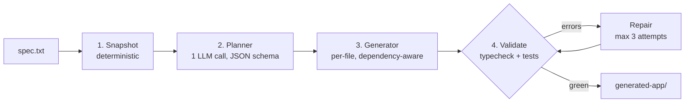

# CLAUDE.md — Agentic Code Generation Workflow (Take-Home Challenge)

This file is the **closed design** for this project. Implement exactly what is specified here.
Do not redesign, do not add abstractions, do not introduce frameworks. When something is
ambiguous, choose the simplest option consistent with this document and flag it in your summary.

## What we are building

A CLI agent (TypeScript, Node.js) that reads a natural-language spec and generates a working
React + TypeScript app **into an existing boilerplate** (React 19, Vite, Apollo Client, MUI,
MSW, Vitest). The agent is a **deterministic workflow** — the code controls the flow, the LLM
executes bounded steps. No LangChain / LangGraph / CrewAI. No autonomous loops.



## Hard rules for Claude Code

1. **Only run `git commit` when the human explicitly asks for it at the end of a stage**, using exactly the commit message from the build-order table. Never `git push`. Before committing, show a summary of changed files.
2. **Never modify the boilerplate at the repo root** (`src/`, `public/`, `index.html`, configs). The agent copies it at runtime; the source stays pristine.
3. **Work one stage at a time.** Only implement the stage the human asks for in the current instruction. Do not "get ahead".
4. **No new runtime dependencies** beyond: `openai` (SDK, used as a generic OpenAI-compatible client), `commander` (or plain `process.argv` — prefer plain argv if commander feels heavy), `dotenv`. Dev deps: `typescript`, `tsx`, `@types/node`.
5. **No classes unless state demands it.** Prefer plain functions + typed data. Each stage is a function `(state: PipelineState, llm: LlmClient) => Promise<PipelineState>` — the client is passed alongside the state rather than stored on it, so `PipelineState` stays plain serialisable data. Snapshot ignores its `llm` argument; the signature is uniform so `pipeline.ts` can call every stage the same way.
6. **Every tool invocation logs one line**: `[tool:writeFile] src/hooks/useCars.ts`, `[tool:runCommand] npm run typecheck`, `[llm:planner] 1,203 in / 890 out tokens`.
7. **Fail gracefully**: invalid LLM JSON → 1 retry with the error included → abort with a clear message and exit code 1. Never print a raw stack trace as the primary output. Designed aborts go through the shared `abort(message)` in `tools/errors.ts`, which tags the error with an `exitCode`; the CLI prints tagged errors as-is and reserves the stack trace for genuinely unexpected throws.
8. Keep prompts in `agent/src/prompts/` exactly as provided below. Prompt tweaks during E2E are made by the human.
9. **The design must never diverge from reality.** Whenever an approved decision, deviation, or refinement changes what this document specifies, CLAUDE.md must be updated in the SAME stage the change is applied. CLAUDE.md is the authoritative design and must always describe the code as it actually exists — never a superseded plan. If a change is applied without updating CLAUDE.md, that is a defect. CONTRACT.md records why the change happened; CLAUDE.md records what the design now is.

## Repository layout

```
repo/                       # the repository root IS the boilerplate — NEVER modified
├── src/                    # boilerplate app source (App, components, graphql, mocks)
├── public/                 # boilerplate static assets (MSW worker)
├── index.html              # boilerplate entry
├── package.json            # boilerplate deps + scripts (dev, build, test, typecheck)
├── tsconfig.json
├── vite.config.ts
├── vitest.config.ts
├── vite-env.d.ts
├── agent/
│   ├── src/
│   │   ├── index.ts        # CLI entry: parses --spec, --dry-run, --out
│   │   ├── pipeline.ts     # main(): snapshot → plan → generate → validate/repair
│   │   ├── stages/
│   │   │   ├── snapshot.ts
│   │   │   ├── planner.ts
│   │   │   ├── generator.ts
│   │   │   └── validator.ts
│   │   ├── tools/
│   │   │   ├── fs.ts       # readTree, readFiles, writeFile, copyDir
│   │   │   ├── shell.ts    # runCommand (spawn, captured stdout/stderr, timeout)
│   │   │   ├── llm.ts      # callText, callTool, dry-run fixtures, usage tracking
│   │   │   └── errors.ts   # abort(): tagged error → clean message + exit code
│   │   ├── prompts/
│   │   │   ├── planner.ts
│   │   │   ├── generator.ts
│   │   │   └── repair.ts
│   │   ├── fixtures/       # dry-run mock responses (coherent set, see below)
│   │   └── types.ts
│   ├── package.json
│   └── tsconfig.json
├── specs/
│   └── car-inventory.txt
├── generated-app/          # output of a real run (deliverable)
├── .env.example            # the ONE env template — agent LLM vars, at the root
├── TODO.md
├── BOILERPLATE.md          # the boilerplate's original README
├── CLAUDE.md               # this file
└── README.md               # written last
```

The agent lives in `agent/` alongside the boilerplate it consumes, per the challenge's
"Getting Started". At runtime the snapshot stage copies the root into `generated-app/`;
the root itself stays pristine.

`agent/tsconfig.json` is `strict` with `moduleResolution: "Bundler"`. Bundler rather than
NodeNext is deliberate: the prompt files transcribed below use extensionless relative imports
(`import type { Task } from '../types';`), which NodeNext rejects. `tsx` resolves them the same
way at runtime, so the prompts stay transcribable verbatim.

## Core types (`agent/src/types.ts`)

```typescript
export type TaskType = 'mock' | 'hook' | 'component' | 'page' | 'test';

export interface Task {
  id: string;            // kebab-case, e.g. "use-cars-hook"
  file: string;          // path relative to generated app root
  description: string;   // includes the exported API (names + signatures)
  type: TaskType;
  dependsOn: string[];   // ids of earlier tasks
}

export interface ValidationError {
  file: string;          // best-effort file attribution
  raw: string;           // untouched error text (fed to repair as-is)
  source: 'typecheck' | 'test';
}

export interface Usage {
  calls: number;
  inputTokens: number;
  outputTokens: number;
}

export interface PipelineState {
  specPath: string;
  spec: string;
  outDir: string;                              // generated-app/
  dryRun: boolean;
  snapshot: { tree: string; files: Record<string, string> };
  plan: Task[];
  generated: Record<string, string>;           // file → content
  validation: { attempt: number; passed: boolean; errors: ValidationError[] };
  usage: Usage;
}
```

## LLM client (`agent/src/tools/llm.ts`)

- Use the **`openai` npm SDK as a generic client** with `baseURL` from env. This makes the
  provider a config choice (Gemini OpenAI-compatible endpoint, OpenRouter, OpenAI, etc.).
- Env vars (validated at startup with a helpful message if missing, unless `--dry-run`):

```
LLM_BASE_URL=https://generativelanguage.googleapis.com/v1beta/openai/
LLM_API_KEY=your-key-here
LLM_MODEL=gemini-2.5-flash
```

- The single **`.env.example` at the repository root is authoritative** for these variables —
  there is no `agent/.env.example`. It documents the three vars with commented example values
  for Gemini (default), OpenRouter, and OpenAI. `dotenv` loads `.env` from the repo root.

- **Factory**: `createLlmClient({ dryRun, usage }): LlmClient`. A free function cannot reach
  `state`, so the client closes over the `Usage` object it is given — in practice `state.usage` —
  and accumulates into it in place. No class (hard rule 5). `pipeline.ts` creates the client once
  and passes it to each stage alongside `state`.
- `callText(system, user): Promise<string>` — plain completion, strips markdown fences defensively.
- `callTool(system, user, tool): Promise<unknown>` — forces the tool call (`tool_choice`), returns parsed arguments.
- Both accumulate the client's `usage` and log one line per call.
- **Tool schemas are provider-agnostic in the prompts.** `submitPlanTool` is declared with
  Anthropic-style `input_schema`; `callTool` translates it to the target provider's format
  (for the OpenAI-compatible client, `function.parameters` plus a forced `tool_choice`). The
  prompt files therefore never encode a provider.
- **Dry-run mode** (`--dry-run` flag): both functions return fixtures from `agent/src/fixtures/`
  instead of calling the API. The fixture set must be **coherent**: the mock plan references
  files, the mock generated files match that plan and import each other correctly, and one
  fixture intentionally contains a type error on the first validation pass with a corrected
  version served on the repair call — so the entire pipeline, including the repair loop, is
  exercisable end-to-end with zero API calls.
- Fixtures use a **neutral toy domain**, never spec content, so they cannot be mistaken for
  hardcoded knowledge of the target app.
- Dry-run addresses fixtures by matching the target file path in the prompt text, and tells a
  repair call from a generation call by the presence of `<validation_errors>`. **A lookup that
  fails is a hard error naming which lookup failed and why — never a fallback fixture**, because a
  silently wrong file would corrupt a dry run invisibly. The cost of this is a coupling to prompt
  text: after any prompt tweak, re-run the dry run to confirm fixtures still resolve.
- Dry-run counts calls but reports **0 tokens** (`[llm:planner] dry-run fixture, 0 tokens`). This is
  deliberate — estimating tokens would put invented numbers in the cost summary.

## Stage contracts

### 1. Snapshot (`stages/snapshot.ts`) — deterministic, no LLM
- `copyDir(repo root → outDir)`. **Principle: copy only what the generated app needs to install,
  run, test and build. Agent-side and repo-side artifacts are not copied.** Any future exclusion
  decision follows from that principle rather than from extending a list by hand.
- Exclusions: `node_modules`, `dist`, `.git`, `agent/`, `generated-app/`, `specs/`, `*.md`,
  `.env`, `.env.example`, `*.tsbuildinfo`, `.DS_Store`, `Thumbs.db`, `.vscode/`, `.idea/`.
- OS and editor artifacts (`.DS_Store`, `Thumbs.db`, `.vscode/`, `.idea/`) are never copied — they
  fail the "needed to install, run, test or build" test by definition.
- `.gitignore` **is** copied. `generated-app/` is committed as a deliverable, and its
  `node_modules` must stay out of git; the copied `.gitignore` keeps that protection local to the
  generated app instead of relying only on the root `.gitignore`. Do not drop it when revisiting
  this list.
- Build `tree` (relative paths, one per line) from the copy, so `tree` and `files` always
  describe the same directory.
- Read into `files`: package.json, tsconfig, vite/vitest configs, MSW handlers + mock data,
  Apollo client setup, App/entry files. Cap: skip any file > 20KB.
- **`KEY_FILES` is a fixed list, deliberately not a heuristic**: the planner must reason over
  identical context on every run, which is what makes a run reproducible and a prompt regression
  attributable. The accepted cost is that a new boilerplate file is not read until the list is
  updated. The mitigation is already in place — `tree` carries **every** file in the copy, so the
  planner always knows what exists and can place new files correctly; it simply does not see the
  contents of anything outside the list. Excluding a file from the snapshot therefore also hides
  it from the planner, since `files` is read from the copy rather than the source.

### 2. Planner (`stages/planner.ts`) — 1 LLM call, schema-enforced
- Uses `PLANNER_SYSTEM` + `plannerUser(...)` + the `submit_plan` tool schema (see prompts).
- Post-validation in code: unique ids, all `dependsOn` reference existing earlier tasks,
  topological sort succeeds (no cycles), all file paths are relative and inside the app root.
- Validation reports **every** problem it finds, not the first: the retry prompt is more useful
  when it lists them together.
- The "earlier tasks only" rule and the cycle check are **deliberately redundant**. Ordering makes
  a cycle unreachable in practice — every cycle contains a forward reference and is reported as
  that — so cycle detection is defensive. `topologicalSort` stays regardless, because it is what
  produces the plan's execution order for the generator.
- The cycle check is skipped while task ids are not unique: the graph is keyed by id, so duplicates
  collapse into a false cycle, and a misleading error in the retry prompt misdirects the model.
- On validation failure: 1 retry appending the validation error to the user prompt; then abort.

### 3. Generator (`stages/generator.ts`) — 1 LLM call per task
- Iterate the plan in topological order.
- Context per task: spec + full plan (id/file/description only) + **full content of direct
  dependencies only** (from `state.generated`) + boilerplate files selected deterministically
  by `task.type`:
  - `mock` → existing MSW handlers + schema
  - `hook` → Apollo client setup + MSW handlers
  - `component`/`page` → nothing extra beyond deps (MUI is known)
  - `test` → file under test + vitest config/setup + MSW handlers
- Write each file immediately; record in `state.generated`.

### 4. Validator + Repair (`stages/validator.ts`) — bounded loop
- Run `npm run typecheck`, then `npm run test -- --run` inside `outDir` (install deps once first).
- Parse errors best-effort: tsc lines → file via regex; vitest failures → test file name.
  Group by file. Unattributable errors go to a catch-all bucket reported to the human.
- For each broken file: repair prompt with { current content, raw errors, direct-dependency
  contents }. Overwrite, re-validate. **Max 3 attempts total.**
- If still red after 3: exit code 1 with a clean summary of remaining failures (this is a
  designed outcome, not a crash).

## Prompts — transcribe verbatim into `agent/src/prompts/`

### `prompts/planner.ts`

```typescript
export const PLANNER_SYSTEM = `You are a senior frontend architect planning the implementation of a React + TypeScript application inside an EXISTING boilerplate project.

Your job is to decompose a product specification into an ordered, dependency-aware list of file-level tasks.

Rules:
- Generate tasks ONLY for files that need to be created or modified. Never plan changes to build configs, package.json, or tooling unless the spec explicitly requires it.
- Respect the existing project structure and conventions shown in the snapshot (paths, aliases, how MSW handlers and Apollo client are wired).
- Order tasks by dependency: data/mocks first, then hooks, then presentational components, then container/page components, then tests LAST (tests depend on final component APIs).
- Each task must reference its dependencies by task id in dependsOn. A task may only depend on earlier tasks.
- Do not introduce new libraries. Use only what exists in package.json.
- Keep the plan minimal: the smallest set of files that fully satisfies the spec. Do not add features the spec does not ask for.
- Every REQUIRED item in the spec must map to at least one task. Optional items: include them only if they are low-risk given the existing stack.`;

export const plannerUser = (spec: string, tree: string, files: Record<string, string>) => `
<specification>
${spec}
</specification>

<project_tree>
${tree}
</project_tree>

<key_files>
${Object.entries(files).map(([path, content]) => `--- ${path} ---\n${content}`).join('\n\n')}
</key_files>

Produce the implementation plan by calling submit_plan.`;

export const submitPlanTool = {
  name: 'submit_plan',
  description: 'Submit the ordered implementation plan',
  input_schema: {
    type: 'object',
    required: ['tasks'],
    properties: {
      tasks: {
        type: 'array',
        items: {
          type: 'object',
          required: ['id', 'file', 'description', 'type', 'dependsOn'],
          properties: {
            id: { type: 'string', description: 'short kebab-case id, e.g. "use-cars-hook"' },
            file: { type: 'string', description: 'path relative to project root, e.g. "src/hooks/useCars.ts"' },
            description: { type: 'string', description: 'what this file does and its exported API (names + signatures)' },
            type: { type: 'string', enum: ['mock', 'hook', 'component', 'page', 'test'] },
            dependsOn: { type: 'array', items: { type: 'string' } },
          },
        },
      },
    },
  },
} as const;
```

### `prompts/generator.ts`

```typescript
import type { Task } from '../types';

export const GENERATOR_SYSTEM = `You are a senior React + TypeScript engineer generating ONE file inside an existing Vite + React 19 + Apollo Client + MUI + MSW + Vitest project.

Output rules (strict):
- Output ONLY the complete content of the target file. No markdown fences, no explanations, no comments about what you did.
- The file must compile under strict TypeScript. All imports must resolve to files shown in the context or to packages in package.json.
- Match the exported API promised in the task description EXACTLY (names and signatures), because other files depend on it.

Code rules:
- Follow the conventions visible in the provided dependency files (import style, component patterns, MUI usage).
- Components: typed props, handle loading and error states for any GraphQL data.
- Hooks: return a stable, minimal API. No side effects beyond the query/mutation itself.
- Tests: use Vitest + Testing Library. Test BEHAVIOR: assert on rendered mock data, on filtered results after user events, on sort order changes. Never write trivial assertions (expect(true), empty snapshots, "renders without crashing" alone). Use the existing MSW handlers for data. Use findBy* queries for async data.`;

export const generatorUser = (task: Task, spec: string, plan: Task[], depFiles: Record<string, string>) => `
<specification>
${spec}
</specification>

<full_plan>
${plan.map(t => `- [${t.id}] ${t.file}: ${t.description}`).join('\n')}
</full_plan>

<current_task>
id: ${task.id}
file: ${task.file}
type: ${task.type}
description: ${task.description}
</current_task>

<dependency_files>
${Object.entries(depFiles).map(([path, content]) => `--- ${path} ---\n${content}`).join('\n\n')}
</dependency_files>

Generate the complete content of ${task.file}.`;
```

### `prompts/repair.ts`

```typescript
export const REPAIR_SYSTEM = `You are a senior React + TypeScript engineer fixing ONE file that failed validation (type-check and/or tests) in an existing project.

Output rules (strict):
- Output ONLY the complete corrected content of the file. No fences, no explanations.
- Make the MINIMAL change that fixes the reported errors. Do not refactor, rename exports, or alter the file's public API — other files depend on it.
- If the error indicates the real bug is in a DIFFERENT file, still output this file unchanged or minimally adjusted, and it will be handled separately.`;

export const repairUser = (file: string, currentContent: string, errors: string, depFiles: Record<string, string>) => `
<file_path>${file}</file_path>

<current_content>
${currentContent}
</current_content>

<validation_errors>
${errors}
</validation_errors>

<dependency_files>
${Object.entries(depFiles).map(([path, content]) => `--- ${path} ---\n${content}`).join('\n\n')}
</dependency_files>

Output the corrected content of ${file}.`;
```

## CLI

```
npm run agent -- --spec specs/car-inventory.txt [--out generated-app] [--dry-run]
```

Startup order: parse args → load .env → validate env (skip if dry-run) → run pipeline →
print summary table: stages executed, LLM calls, tokens in/out, validation attempts,
final status, output path.

## Build order (one instruction from the human per stage)

| Stage | Deliverable | Human commit |
|---|---|---|
| 0 | Scaffold + this file + TODO.md | 1: chore: agent design, task breakdown and sample spec |
| 1 | types.ts + tools (fs, shell, llm with dry-run) | 2: feat: pipeline types + tool layer |
| 2 | snapshot + planner + plan post-validation | 3: feat: snapshot + LLM planner with schema enforcement |
| 3 | generator (topological, dependency context) | 4: feat: dependency-aware file generator |
| 4 | validator + repair loop + error parser | 5: feat: validate/repair loop with bounded retries |
| 5 | E2E run, prompt tweaks (human-driven) | 6: feat: sample spec + generated output from full run |
| 6 | README (human-driven) | 7: docs: architecture, tradeoffs, cost analysis |

A stage may land as **several focused commits** when it has separable concerns; the table names the
stage's headline scope, not a one-commit-per-stage rule. When hard rule 9 triggers, the design
reconciliation is its own `docs:` commit at the end of the stage so the code commits stay readable.
Stage 1 landed as four commits.

## Explicitly out of scope (do not build)

- Authentication, JWT, RBAC, CI/CD, deployment, real backend, databases.
- Agent frameworks (LangChain, LangGraph, CrewAI, Mastra).
- RAG / embeddings — the whole boilerplate fits in context; dependency-graph context
  selection is the mechanism.
- Restructuring the boilerplate's architecture.
- Mutation testing (Stryker) — documented as future work in README only.
