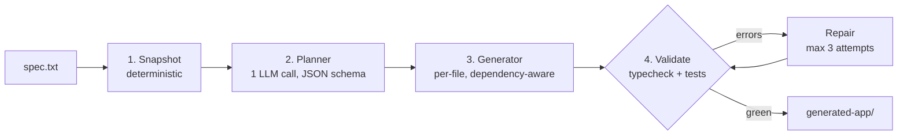

# spec-to-app agent

A CLI agent that reads a natural-language specification and generates a working React + TypeScript
application into a copy of the boilerplate in this repository.

It is a deterministic four-stage workflow — snapshot, plan, generate, validate/repair. The code owns
the control flow; the LLM executes bounded steps. No agent framework, no autonomous loop.

The `generated-app/` directory in this repository is the real output of one real run, committed
unedited.

## Quick start

```bash
npm install                 # agent + boilerplate deps
npm install --prefix agent

cp .env.example .env        # then fill in LLM_API_KEY

rm -rf generated-app        # the committed output; remove for a clean run
npm run agent -- --spec specs/car-inventory.txt

cd generated-app && npm install && npm run dev
```

Three environment variables, all in `.env.example` at the repository root:

```
LLM_BASE_URL=https://generativelanguage.googleapis.com/v1beta/openai
LLM_API_KEY=your-key-here
LLM_MODEL=models/gemini-3.6-flash
```

The client is the `openai` SDK pointed at an arbitrary `baseURL`, so **any OpenAI-compatible
provider works** by changing those three values. `.env.example` carries working blocks for Gemini,
OpenRouter and OpenAI.

Two things that cost real debugging time on the first runs, so they are worth stating plainly:

- **`LLM_BASE_URL` must not end in a slash.** The client appends `/chat/completions` to it.
- **Model ids change, and providers name them differently.** Gemini's OpenAI-compatible route needs
  the `models/` prefix; OpenRouter namespaces by vendor; OpenAI takes bare ids. If a run fails with
  a model or 404 error, ask the provider what your key can actually use:
  ```bash
  curl -H "Authorization: Bearer $LLM_API_KEY" "$LLM_BASE_URL/models"
  ```

`--dry-run` runs the entire pipeline, repair loop included, from bundled fixtures — no key, no
network, no cost. Useful for seeing the shape of a run before spending anything.

```bash
npm run agent -- --spec specs/car-inventory.txt --dry-run
```

`generated-app/` is written in place, not replaced: a second run copies the boilerplate over
whatever is already there and leaves earlier generated files behind, so `rm -rf generated-app`
first — or pass `--out` elsewhere — for a clean run.

Other flags: `--out <dir>` (default `generated-app`), `--help`.

## Architecture



Each stage is a plain function `(state: PipelineState, llm: LlmClient) => Promise<PipelineState>`.
`pipeline.ts` applies four of them in order; that array *is* the control flow, and it fits on one
screen deliberately.

**1. Snapshot** — deterministic, no LLM call. Copies the repository root into the output directory,
excluding agent-side and repo-side artifacts, then builds a file tree and reads fourteen key files
into memory. The tree lists *every* file in the copy; only those fourteen carry contents.

**2. Planner** — one LLM call, schema-enforced through a forced tool call, so the response shape is
guaranteed. Shape is not coherence, so everything the schema cannot express is checked in plain
TypeScript: unique ids, unique output files, dependencies that exist and are declared earlier,
paths that stay inside the app root, a topological sort that succeeds. A failing plan gets exactly
one retry with every problem listed; a second failure aborts with exit code 1.

**3. Generator** — one call per task, walking the plan in topological order, writing each file
immediately. Context is assembled by deterministic code — a switch on task type — never by the
model: direct dependencies only, plus the boilerplate files that task type needs, plus the
project's own `Example.tsx` and `Example.test.tsx` as few-shot style references. No retries here; a
file that fails to compile is the validator's problem.

**4. Validator + repair** — installs once, then runs `npm run typecheck` and `npm run test -- --run`
on every pass. Failures are parsed best-effort and grouped by file; anything unattributable goes to
a catch-all that is always reported. Each broken file gets one repair call carrying its current
content, the raw error text, and its direct dependencies. Bounded at three validation passes.

## Design decisions and tradeoffs

**Deterministic workflow over an agent framework.** The stages, their order, and the retry bounds
are ordinary code. An agent framework would move that control flow into a model's judgment, which
buys flexibility this problem does not need and costs the two things it does: reproducibility and
debuggability. When a run fails here, the failing step is a named function with a known input.
The cost is that the workflow cannot adapt to a spec that needs a different shape of work — a spec
demanding a backend would produce a plan the pipeline dutifully executes and the validator rejects.

**RAG considered and rejected.** The entire boilerplate fits comfortably in context, so retrieval
would add an embedding index, a similarity threshold and a class of silent recall failures to solve
a problem that does not exist at this scale. The mechanism that replaces it is the dependency
graph: each generator call receives its direct dependencies — never the transitive closure — plus a
fixed set of boilerplate files chosen by task type. That is exact rather than approximate, and it
is why the nine non-planner calls average about 1,959 input tokens. At a scale where the project no
longer fits in context, retrieval becomes the right answer.

**Tool calling where the output is data; plain text where the output is code.** The planner returns
a structured plan, so it uses a forced tool call and the provider guarantees the shape. The
generator and repair steps return file contents, where a JSON envelope buys nothing and costs
escaping bugs, truncation risk and tokens spent encoding newlines. Fences are stripped defensively
and empty output aborts.

**Repair bounded at three validation passes.** That means **two repair opportunities**: the third
pass validates and, if still red, aborts — it does not repair again. An unbounded loop against a
weak model does not converge, it spends; the section below has the measurement. Failing after three
attempts is a designed outcome, reported as a summary grouped by file with exit code 1, never as a
stack trace.

**The plan is the contract between files.** Each task description carries its file's exported API —
names and signatures — because the files are generated in separate calls that never see each other's
prompts. A component generated in call four compiles against a hook generated in call two only
because the plan stated that hook's signature and the generator was instructed to match it exactly.
This is what makes per-file generation possible without a shared context window, and it is why plan
validation is worth its own retry.

## Which LLM, and why

Default: **`models/gemini-3.6-flash`**, via Gemini's OpenAI-compatible endpoint.

The choice is measured, not preferred. Same agent, same prompts, same spec, only `LLM_MODEL`
changed — though the two runs also produced different plans, 7 tasks on Flash-Lite against 5 on
Flash, so the models were repairing different code. This is an observed difference across two real
runs, not a controlled A/B; the cost figures below are what each run actually spent.

| Model | Plan | Repair cost per call | Outcome |
|---|---|---|---|
| `models/gemini-3.6-flash` | correct | 586–1,862 input tokens | **passed**, green on attempt 2 |
| `models/gemini-flash-lite-latest` | correct | ~12,955 input tokens | **failed to converge** — 3 attempts, the same three test failures each time |

Flash-Lite **plans correctly**, so the failure is not comprehension at planning altitude. It fails
in repair, and it fails expensively: roughly 7–22× the input tokens per repair call while making no
progress across three attempts on identical failures.

That result also turns the bounded loop from a formality into a demonstrated necessity. A weaker
model does not fail loudly — it loops, producing plausible edits that do not fix anything. The cap
is what converts an open-ended spend into a clean exit 1 with a report of what is still broken.

**Caveat:** only Gemini was tested end to end. The client is provider-agnostic and the prompts
encode no provider, but tool-calling fidelity varies, and the planner depends on a forced tool call
being honoured. A provider that treats `tool_choice` as advisory would fail at stage two.

## Cost per run

Measured from the run that produced the committed `generated-app/`:

| Metric | Value |
|---|---|
| LLM calls | **10** — 1 planner, 5 generator, 4 repair |
| Tokens in / out | **21,930 / 6,199** |
| Planner call | 4,298 in / 417 out |
| Repair calls | 586–1,862 input tokens each |
| Validation attempts | 2 of 3 — red on attempt 1, green on attempt 2 |
| Delivered test suite | 6 tests — 4 generated, plus the boilerplate's own 2 |

No dollar figure is given on purpose. The token counts are measured; a price is not, and published
rates change faster than this file will. Convert at your provider's current rate.

Three numbers that argue for design choices rather than merely describing the run:

- **The single planner call is 20% of all input tokens** (4,298 of 21,930). One call carrying the
  file tree and fourteen key files costs about as much as two or three generator calls. That is the
  argument for schema-enforcing it and validating the plan in code rather than retrying it blind — a
  wasted planner retry is the most expensive mistake the pipeline can make.
- **The other nine calls average ~1,959 input tokens.** That is dependency-graph context selection
  working: each call sees its direct dependencies and its task type's boilerplate, not the project.
- **4 of the 5 generated files failed first validation** and were repaired in a single round. The
  repair loop is load-bearing on an ordinary run, not a rarely-fired safety net. Any honest account
  of this architecture has to say that the generator alone does not produce a working app.

## What worked well

Measured, from the committed Flash run unless noted:

- **Plan validation passed on attempt 1 in both model runs**, including the one that later failed
  to converge. Schema enforcement plus in-code checks did their job; the retry was never needed.
- **Dependency-graph context selection held the nine non-planner calls to ~1,959 input tokens on
  average**, against a boilerplate that would not have been cheap to send whole.
- **Test-failure retargeting behaved as designed** — the run log shows repair aimed at the component
  under test rather than at the failing test, which is the behaviour that keeps a green run
  meaningful.
- **The pipeline converged in a single repair round**, red on validation attempt 1 and green on
  attempt 2, with four of five generated files repaired in that one round.

## What the real runs taught

**Validator output is prompt input, not diagnostics.** Every error string this agent produces is
injected verbatim into a retry or repair prompt, which changes what "good enough" means for an error
message. Two instances, both real:

- Plan validation initially reported a dependency cycle alongside a duplicate-id error, because the
  graph is keyed by task id and duplicates collapse into a false cycle. As a log line that is mild
  noise. As prompt input it would have sent the model hunting a defect that did not exist while the
  real one competed for attention — and cost one of only two attempts.
- The test-output parser matched only `FAIL <path> > suite > case`. Vitest prints
  `FAIL <path> [ <path> ]` when a suite cannot be collected at all, so that entire class fell
  through to a catch-all that dumped raw output — whose first line was npm's script echo. A loop
  designed to surface failure reported a phantom, and burned two of three attempts on it. The real
  error was sitting in output the agent had already captured and thrown away in parsing.

**Repair must target the file under test, never the test.** A failing assertion almost always means
the implementation is wrong. A repair loop pointed at the test file will reach green by weakening
assertions, and the summary will print `passed`. The fix is structural — the target is resolved from
the plan, since a test task's `dependsOn` names what it exercises — and reinforced in the prompt: the
test is authoritative, fix the implementation, never weaken an assertion. This is the single change
most likely to separate a useful agent from one that reports success.

**Dry runs only prove what they exercise.** The fixture harness passed every unit-level check,
including three deliberately hostile failure cases, because those fed it hand-written prompts. The
first time it saw a real generator prompt it silently returned the same fixture for all four tasks:
lookup scanned the whole prompt for any known path, and the generator prompt embeds the full plan,
so every task's prompt mentions every file. It was caught only because the run printed per-file
character counts — four identical lengths were the tell that a "4 files written" success line would
have hidden. Fixtures also never return network errors, npm preambles, rate limits or provider
quirks, so a green dry run is evidence about the pipeline's shape and nothing else.

**The agent exposed a latent fragility in the boilerplate.** `vitest.config.ts` resolved its setup
file with a relative path, which Vite resolves against whichever project it considers the root. That
is correct in place and wrong the moment the project is copied into a subdirectory of another Vite
project — so the boilerplate's own test failed inside every generated app, silently, while
typecheck, build and dev all passed. Nobody had ever copied it before. Setting `root` does not fix
it; only an absolute setup path does.

**Model choice is a functional property, not a preference.** See the section above: the difference
between converging on attempt 2 and not converging at all tracked the model. Not a controlled
comparison — the two runs planned differently, so they were repairing different code — but the gap
is large enough, and the failure mode specific enough, to act on.

## Assumptions

The specification leaves several things open. Where it did, the agent chose and the choice is
visible in the committed output rather than hidden:

- **Image selection.** The `Car` type carries `mobile`, `tablet` and `desktop` URLs, and the spec
  asks only for "an image of the car". The generated `CarCard` uses
  `car.desktop || car.tablet || car.mobile`. Responsive `srcSet` selection is an optional item in
  the brief and was not requested by the spec, so it was not built.
- **Search semantics.** "Filters the list by model as the user types" was implemented as a
  case-insensitive substring match on `model`, trimmed.
- **Sort direction.** "Sort by year or by make" does not state a direction. The generated code sorts
  make ascending by locale comparison and year ascending numerically.
- **Scope discipline.** The brief lists optional extras — an `AddCar` mutation, a `GetCar` query, a
  year filter, a `useCarFilters()` hook. None appear in the spec, and the planner is instructed to
  keep plans minimal, so none were built. The five generated files are the smallest set that
  satisfies the spec.

**Three modifications were made to the boilerplate.** The brief explicitly permits updating
boilerplate configs to improve agent output quality; each is recorded in `CLAUDE.md` and justified
there:

1. `package.json` — an `agent` script, so the agent runs with the single command the brief asks for.
2. `vitest.config.ts` — an absolute `setupFiles` path, without which the delivered app's suite does
   not run at all. Fixing it here rather than during snapshot keeps the snapshot stage copy-only:
   an agent that rewrites the tree it copies is a harder thing to trust.
3. `vitest.config.ts` — `generated-app/**` excluded from the root test run, so `npm test` at the
   repository root does not collect the generated app's tests and show misleading red.

Two of the three exist only because the brief's structure places the generated app inside the
repository that produced it.

## Known limitations

- **Per-file repair sees one file's errors at a time.** A defect spanning two files — an exported
  signature and its consumer — gives each repair call half the picture. Widening the context to
  co-dependents brings its own cost and oscillation risk, so it was left alone and watched.
- **Warning-class issues are invisible to the validator.** It keys on failure, and a warning is not
  one. The generated test passes `addTypename` to `InMemoryCache`, which Apollo 3.14 has removed and
  warns about; typecheck is green, the suite is green, the command exits 0, so no error text exists
  to attribute to a file or feed the repair loop. This is a real boundary of the design, not an
  oversight — a validate/repair loop can only fix what its tools call an error.
- **`KEY_FILES` is a fixed set of fourteen paths.** A new boilerplate file is not read until that
  list is updated. This is deliberate: identical planner context on every run is what makes a run
  reproducible and a prompt regression attributable to the prompt. The file *tree* still lists
  everything, so the planner always knows what exists.
- **The generated app inherits the root config's `generated-app/**` test exclusion.** Inert — there
  is no nested `generated-app` inside it — but visible in the delivered config. Left untouched
  because the deliverable is pure agent output, and hand-editing it would destroy the property that
  makes it evidence.

## Production hardening

Deliberately out of scope here, and what would come next:

- **Mutation testing** on the generated suite. The validator proves tests pass; it does not prove
  they would fail if the implementation broke. Given that repair is one prompt line away from
  weakening assertions, generated-test quality deserves a stronger check than "green".
- **Multi-spec evals with success-rate tracking.** One spec proves the pipeline runs. A corpus with
  a tracked pass rate is what turns a prompt change from a guess into a measurement.
- **Per-stage token and latency observability.** The summary reports totals; attributing spend to
  stage, task type and repair round is what would tell you where a regression actually lives.
- **Prompt caching.** The spec, the plan and the boilerplate context are re-sent on every generator
  call and are largely identical between them — the most obvious available saving.
- **Retry with backoff on rate limits.** A 429 currently aborts mid-generation and discards
  completed work. The state to resume from already exists in `state.generated`; nothing consumes it.

## Repository

| Path | What it is |
|---|---|
| `agent/` | the agent: stages, tools, prompts, dry-run fixtures |
| `specs/car-inventory.txt` | the sample specification the agent consumes |
| `generated-app/` | output of one real run, committed unedited — no README of its own, deliberately: see below |
| `src/`, `public/`, configs | the boilerplate, otherwise unmodified |
| `TODO.md` | the original task breakdown, written before any code |
| `CLAUDE.md` | the design document |
| `BOILERPLATE.md` | the boilerplate's original README |

`generated-app/` deliberately contains no README, and no hand-written file of any kind. Everything
in it is what the agent produced, down to the inherited test exclusion noted above. Adding
instructions to it would make it a nicer directory and a weaker piece of evidence — the run command
for it is in Quick start instead.

`CLAUDE.md` is the authoritative design, and it was kept in sync with the code at every stage rather
than written once and left behind: a rule in it requires that any approved change be reflected there
in the same stage it lands. Reading it alongside the git history shows what was decided, when, and
what the code did about it. `TODO.md` is the up-front breakdown, with each ticket's acceptance
criterion and the commits it actually landed as.
