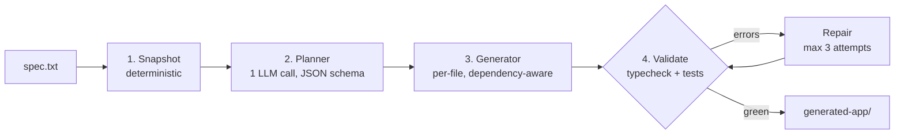

# TODO — Agentic Code Generation Workflow

## Problem statement

Build a CLI agent (TypeScript / Node) that reads a natural-language specification and generates a
working React + TypeScript application into a copy of the existing boilerplate. The agent is a
deterministic four-stage workflow — code owns the control flow, the LLM executes bounded steps —
and it self-validates by running the type-checker and test suite, feeding failures back into a
repair loop.

## Pipeline



## Target structure

```
repo/                       # the repository root IS the boilerplate — NEVER modified
├── src/                    # boilerplate app source (App, components, graphql, mocks)
├── public/                 # boilerplate static assets (MSW worker)
├── index.html              # boilerplate entry
├── package.json            # boilerplate deps + scripts (dev, build, test, typecheck)
├── tsconfig.json
├── vite.config.ts
├── vitest.config.ts
├── vite-env.d.ts
├── agent/
│   ├── src/
│   │   ├── index.ts        # CLI entry: parses --spec, --dry-run, --out
│   │   ├── pipeline.ts     # main(): snapshot → plan → generate → validate/repair
│   │   ├── stages/
│   │   │   ├── snapshot.ts
│   │   │   ├── planner.ts
│   │   │   ├── generator.ts
│   │   │   └── validator.ts
│   │   ├── tools/
│   │   │   ├── fs.ts       # readTree, readFiles, writeFile, copyDir
│   │   │   ├── shell.ts    # runCommand (spawn, captured stdout/stderr, timeout)
│   │   │   └── llm.ts      # callText, callTool, dry-run fixtures, usage tracking
│   │   ├── prompts/
│   │   │   ├── planner.ts
│   │   │   ├── generator.ts
│   │   │   └── repair.ts
│   │   ├── fixtures/       # dry-run mock responses (coherent set, see below)
│   │   └── types.ts
│   ├── package.json
│   └── tsconfig.json
├── specs/
│   └── car-inventory.txt
├── generated-app/          # output of a real run (deliverable)
├── .env.example            # the ONE env template — agent LLM vars, at the root
├── TODO.md
├── BOILERPLATE.md          # the boilerplate's original README
├── CLAUDE.md               # design document
└── README.md               # written last
```

`repo/` is the repository root, and it **is** the boilerplate — the challenge's "Getting Started"
instructs building the agent in a separate folder within it. The snapshot stage copies the root
into `generated-app/` on one principle — copy only what the generated app needs to install, run,
test and build — excluding `node_modules`, `dist`, `.git`, `agent/`, `generated-app/`, `specs/`,
`*.md`, `.env`, `.env.example`, `*.tsbuildinfo`, and OS/editor artifacts (`.DS_Store`,
`Thumbs.db`, `.vscode/`, `.idea/`). `.gitignore` is copied: `generated-app/` is committed as a
deliverable and its `node_modules` must stay out of git.

## Tickets

- [x] **Stage 0 — Scaffold + planning artifacts**
  - Scope: verify the boilerplate runs, audit repo structure, housekeeping (.gitignore, README rename, root `.env.example` rewritten to the agent's `LLM_*` vars), write CLAUDE.md and TODO.md.
  - Acceptance: `npm install`, `npm run typecheck`, `npm run test`, `npm run build` and `npm run dev` all succeed on the untouched boilerplate; TODO.md lists every stage with acceptance criteria.
  - Commit: `chore: agent design, task breakdown and sample spec`

- [x] **Stage 1 — Types + tool layer**
  - Scope: `agent/src/types.ts` plus `tools/fs.ts`, `tools/shell.ts`, `tools/llm.ts` (including dry-run fixture loading and token accounting).
  - Acceptance: `agent/` type-checks; every tool call emits exactly one log line in the specified format; `callText`/`callTool` return fixtures under `--dry-run` with zero network access.
  - Commits: `feat: agent project scaffold and pipeline types`, `feat: filesystem and shell tool layer`, `feat: OpenAI-compatible LLM client with dry-run fixtures`, `docs: reconcile design with tool-layer decisions`

- [x] **Stage 2 — Snapshot + planner**
  - Scope: `stages/snapshot.ts` (copy boilerplate, build tree, read key files) and `stages/planner.ts` (one schema-enforced LLM call plus in-code plan validation).
  - Acceptance: the snapshot copies exactly the entries the generated app needs — `package.json`, `package-lock.json`, `src/`, `public/`, `index.html`, `vite.config.ts`, `vitest.config.ts`, `tsconfig.json`, `vite-env.d.ts`, and `.gitignore` (so the committed `generated-app/` keeps its own `node_modules` out of git) — and no agent-side, repo-side, OS or editor artifact; a dry run then produces a plan whose ids are unique, whose `dependsOn` entries all reference earlier tasks, that topologically sorts without cycles, and whose file paths are relative and inside the app root; an invalid plan triggers exactly one retry, then aborts with exit code 1 and a readable message.
  - Commits: `feat: planner prompts transcribed from the design`, `feat: shared abort helper for designed failures`, `feat: snapshot stage`, `feat: planner stage with in-code plan validation`, `docs: reconcile design with planner decisions`

- [x] **Stage 3 — Generator**
  - Scope: `stages/generator.ts` — iterate the plan in topological order, one LLM call per task, context assembled from direct dependencies plus type-selected boilerplate files.
  - Acceptance: a dry run writes every planned file to `generated-app/` in dependency order and records each in `state.generated`; no task receives context for a file it does not depend on.
  - Commits: `fix: anchor dry-run fixture resolution on an unambiguous prompt marker`, `feat: generator prompts transcribed from the design`, `feat: dependency-aware file generator`, `feat: one task per output file in plan validation`, `docs: reconcile design with generator decisions`

- [x] **Stage 4 — Validator + repair loop**
  - Scope: `stages/validator.ts` — install deps once, run typecheck then tests in the output directory, parse and attribute errors, repair per file, bounded at 3 attempts.
  - Acceptance: the dry-run fixture set fails validation on attempt 1 and passes after the repair call; unattributable errors land in a reported catch-all bucket; still-red after 3 attempts exits 1 with a clean summary and no raw stack trace.
  - Commits: `feat: repair prompts transcribed from the design`, `feat: validate/repair loop with bounded retries`, `feat: pipeline orchestration and CLI`, `chore: single-command agent script in root package.json`, `docs: reconcile design with validation decisions`

- [ ] **Stage 5 — End-to-end run**
  - Scope: run the agent against `specs/car-inventory.txt` with a real provider, tune prompts by hand, commit the resulting `generated-app/`.
  - Acceptance: `cd generated-app && npm install && npm run dev` serves the app, and its own typecheck and tests pass; the generated app satisfies every REQUIRED item in the spec (car list from the GetCars query, search by model, sort by year/make, MUI cards, `useCars()` hook, behavioral tests).
  - Commit: `feat: sample spec + generated output from full run`

- [ ] **Stage 6 — README**
  - Scope: root `README.md` — setup, architecture overview and diagram, LLM provider choice, design tradeoffs, measured cost per run, future work.
  - Acceptance: covers the challenge's write-up requirements — which LLM and why, agent architecture, approximate tokens and API cost per run, how to run the agent from a clean clone.
  - Commit: `docs: architecture, tradeoffs, cost analysis`

## Out of scope

- **Authentication / JWT / RBAC** — no real backend exists; the brief explicitly excludes it.
- **CI/CD and deployment** — the brief excludes it; scope stays on the agent and its output.
- **Real backend or database** — MSW mocks the GraphQL API by design; building one would contradict the boilerplate.
- **Agent frameworks (LangChain, LangGraph, CrewAI, Mastra)** — the brief prefers a clean script over a sprawling abstraction layer; a deterministic workflow makes the control flow auditable.
- **RAG / embeddings** — the whole boilerplate fits in the context window; dependency-graph context selection is the cheaper, more precise mechanism.
- **Mutation testing (Stryker)** — cost outweighs the value at this scope; noted as future work in the README.
- **Restructuring the boilerplate's architecture** — the agent must generate *into* the existing structure, not replace it.
